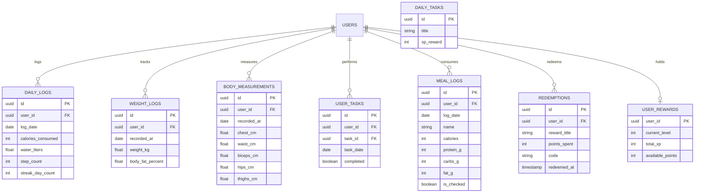

# FitForge — Backend Requirements Specification (Member Dashboard)

This document provides a comprehensive technical specification of all backend APIs, database schemas, AI services, and real-time triggers required to fully power the **Member Dashboard Frontend** (`lib/dashboard/`).

---

## 1. Overview & Backend Status Summary

The FitForge Flutter frontend for Normal Users (Members) includes 13 screens with rich interactive capabilities. Below is the audit of backend readiness for each feature domain in `lib/dashboard/`:

| Dashboard Feature Module | Frontend Screen(s) | Current Backend Status | Action Required from Backend |
|---|---|---|---|
| **Auth & Session Security** | `settings_screen.dart` | ✅ **Ready** | `GET /auth/sessions`, `DELETE /auth/sessions/:id`, `POST /auth/logout-all` |
| **Profile & Media Upload** | `profile_screen.dart`, `edit_profile_screen.dart` | ✅ **Ready** | `PATCH /users/me`, `GET/PATCH /members/me/profile`, `POST /media/presign-upload` |
| **Subscriptions & Entitlements** | `billing_plans_screen.dart` | 🟡 **Partial** | Active: `GET /subscriptions/me`, `GET /subscriptions/me/entitlements`, `POST /subscriptions/me/trial`<br>❌ Missing: Transaction / Invoice PDF history |
| **Gym Join & Public Info** | `join_gym_screen.dart` | ✅ **Ready** | `POST /gyms/join`, `GET /gyms/:gymId` |
| **QR Attendance Check-in** | `qr_checkin_screen.dart` | ✅ **Ready** | `POST /gyms/:gymId/attendance/check-in` |
| **Referrals & Invite System** | `referral_screen.dart` | ✅ **Ready** | `GET .../referrals/my-code`, `POST .../referrals/redeem`, `GET .../referrals/my-referrals` |
| **Daily Fitness & Task Tracking** | `home_dashboard.dart` | ❌ **Missing (Mock)** | Needs Daily Logs, Water Logging, Step Logging, Daily Quests/Tasks APIs |
| **Diet Plan & Macro Tracker** | `diet_plan_screen.dart` | ❌ **Missing (Mock)** | Needs Active Meal Plan, Daily Food Checklist Logging, Macro Balance APIs |
| **AI Meal Builder & Food Catalog** | `meal_builder_screen.dart` | ❌ **Missing (Mock)** | Needs Food Item Catalog, Custom Meal Saving, AI Meal Plan Generator endpoint |
| **Progress & Body Analytics** | `progress_analytics_screen.dart` | ❌ **Missing (Mock)** | Needs Weight Logs, Body Measurement History, Report Export (PDF/CSV) APIs |
| **Gamification, Streaks & Rewards** | `rewards_screen.dart` | ❌ **Missing (Mock)** | Needs User XP/Level, Streak Counter & Claiming, Rewards Store & Redemption APIs |
| **Leaderboards** | `leaderboard_screen.dart` | ❌ **Missing (Mock)** | Needs Global & Gym Leaderboards (XP, Streak, Volume) with Time Filters |

---

## 2. API Endpoint Requirements by Module

### Module A: Home Dashboard & Daily Tracking (`home_dashboard.dart`)

The Home Dashboard tracks a user's daily metrics (Calories, Water, Steps, Streaks) and Daily Tasks.

#### 1. `GET /members/me/dashboard/today`
Returns summary of today's fitness progress, daily task completion, and active streaks.

- **Request Headers**: `Authorization: Bearer <token>`
- **Response `200 OK`**:
```json
{
  "date": "2026-07-31",
  "streakDays": 12,
  "calories": {
    "consumed": 2200,
    "target": 2500
  },
  "water": {
    "currentLiters": 2.5,
    "targetLiters": 4.0
  },
  "steps": {
    "current": 6420,
    "target": 10000
  },
  "tasks": [
    { "id": "task_1", "title": "Drink 4L Water", "completed": false, "xp": 50 },
    { "id": "task_2", "title": "Reach Protein Goal", "completed": false, "xp": 50 },
    { "id": "task_3", "title": "Walk 8000 Steps", "completed": true, "xp": 50 },
    { "id": "task_4", "title": "Complete Workout", "completed": false, "xp": 50 }
  ],
  "todayWorkout": {
    "id": "w_101", "title": "Upper Body Power", "durationMinutes": 45, "estimatedCalories": 320, "isCompleted": false
  }
}
```

#### 2. `POST /members/me/logs/water`
Logs water intake increments (e.g. +0.25L, +0.5L).

- **Payload**:
```json
{
  "amountLiters": 0.5,
  "timestamp": "2026-07-31T10:30:00Z"
}
```
- **Response `200 OK`**: `{ "currentLiters": 3.0, "targetLiters": 4.0 }`

#### 3. `PATCH /members/me/tasks/:taskId`
Toggles completion of a daily task and credits XP to the user.

- **Payload**: `{ "completed": true }`
- **Response `200 OK`**: `{ "taskId": "task_1", "completed": true, "xpGained": 50, "totalXp": 450 }`

---

### Module B: Diet Plan & AI Meal Builder (`diet_plan_screen.dart`, `meal_builder_screen.dart`)

Manages macro targets, daily meal checklists, custom meal creation, and AI-powered meal generation.

#### 1. `GET /members/me/diet/today`
Fetches current day's assigned diet plan, target macros, and consumed meals checklist.

- **Response `200 OK`**:
```json
{
  "date": "2026-07-31",
  "targets": { "calories": 2500, "protein": 140, "carbs": 220, "fat": 70 },
  "consumed": { "calories": 1250, "protein": 85, "carbs": 112, "fat": 38 },
  "meals": [
    {
      "id": "meal_1",
      "name": "Protein Oats Bowl",
      "icon": "🥣",
      "calories": 450,
      "protein": 28,
      "carbs": 45,
      "fat": 12,
      "checked": true,
      "isCustom": false
    },
    {
      "id": "meal_2",
      "name": "Greek Yogurt Bowl",
      "icon": "🥛",
      "calories": 180,
      "protein": 15,
      "carbs": 12,
      "fat": 8,
      "checked": false,
      "isCustom": false
    }
  ],
  "aiInsights": [
    "You're on track to reach today's protein goal.",
    "Drink another 500 ml of water before this afternoon.",
    "Adding one fruit serving will improve today's fiber intake."
  ]
}
```

#### 2. `PATCH /members/me/diet/meals/:mealId/check`
Toggles meal completion status and recalculates consumed macros.

- **Payload**: `{ "checked": true }`
- **Response `200 OK`**: `{ "mealId": "meal_2", "checked": true, "updatedConsumed": { ... } }`

#### 3. `GET /food-items`
Fetches food catalog for the Meal Builder with search, category filter, and pagination.

- **Query Parameters**: `?category=Proteins&search=chicken&page=1&limit=20`
- **Response `200 OK`**:
```json
{
  "items": [
    {
      "id": "food_1",
      "name": "Grilled Chicken",
      "emoji": "🍗",
      "category": "Proteins",
      "servingSize": "100g",
      "caloriesPerServing": 165,
      "proteinPerServing": 31,
      "carbsPerServing": 0,
      "fatPerServing": 4
    }
  ]
}
```

#### 4. `POST /members/me/diet/meals`
Saves a built custom meal into the user's daily meal log or custom recipe library.

- **Payload**:
```json
{
  "name": "Post-Workout Lunch Bowl",
  "items": [
    { "foodItemId": "food_1", "quantity": 2 },
    { "foodItemId": "food_7", "quantity": 1 }
  ]
}
```

#### 5. `POST /ai/generate-meal-plan` *(AI Integration)*
Uses backend LLM pipeline to generate personalized meal options based on remaining macros, budget, and dietary preferences.

- **Payload**:
```json
{
  "remainingCalories": 850,
  "remainingProtein": 55,
  "remainingCarbs": 70,
  "remainingFat": 22,
  "dietaryPreference": "HIGH_PROTEIN",
  "budgetBand": "MID_RANGE"
}
```
- **Response `200 OK`**: Array of suggested meal compositions formatted with exact macros.

---

### Module C: Progress Analytics (`progress_analytics_screen.dart`)

Tracks historical progress for weight, body measurements, hydration, and activity.

#### 1. `GET /members/me/analytics/summary`
Fetches weight trends, body measurements, and monthly analytics summary.

- **Query Parameters**: `?range=week|month|3months|year`
- **Response `200 OK`**:
```json
{
  "range": "month",
  "weight": {
    "currentKg": 78.0,
    "startKg": 84.0,
    "targetKg": 75.0,
    "history": [
      { "date": "2026-07-01", "weightKg": 79.8 },
      { "date": "2026-07-08", "weightKg": 79.5 },
      { "date": "2026-07-15", "weightKg": 79.1 },
      { "date": "2026-07-22", "weightKg": 78.6 },
      { "date": "2026-07-29", "weightKg": 78.0 }
    ]
  },
  "measurements": {
    "chestCm": 102.5,
    "waistCm": 81.0,
    "bicepsCm": 38.5,
    "hipsCm": 96.0,
    "thighsCm": 58.0,
    "lastLoggedDate": "2026-07-25"
  },
  "hydration7Days": [3.2, 4.2, 3.5, 4.5, 3.8, 4.0, 3.9],
  "activity": {
    "workoutsCompleted": 18,
    "totalVolumeKg": 42500,
    "consistencyRatePercent": 88.5,
    "activeMinutes": 940
  }
}
```

#### 2. `POST /members/me/logs/weight`
Logs a new weight entry.

- **Payload**: `{ "weightKg": 77.8, "bodyFatPercent": 15.2, "date": "2026-07-31" }`

#### 3. `POST /members/me/logs/measurements`
Logs body circumference measurements.

- **Payload**: `{ "chestCm": 102.0, "waistCm": 80.5, "bicepsCm": 39.0 }`

#### 4. `GET /members/me/analytics/export`
Generates and streams a PDF/CSV progress summary report.

- **Query Parameters**: `?format=pdf&month=2026-07`
- **Response**: Binary file download (`application/pdf`).

---

### Module D: Gamification, Streaks & Rewards (`rewards_screen.dart`)

Powers user levels, XP progression, daily check-in rewards, and point redemption store.

#### 1. `GET /members/me/rewards/overview`
Fetches XP level progress, streak status, unlocked badges, and daily check-in board.

- **Response `200 OK`**:
```json
{
  "level": 5,
  "levelTitle": "Fitness Enthusiast",
  "currentXp": 450,
  "nextLevelXp": 1000,
  "totalPoints": 1250,
  "streakDays": 12,
  "dailyCheckInBoard": [
    { "day": 1, "rewardXp": 20, "claimed": true },
    { "day": 2, "rewardXp": 30, "claimed": true },
    { "day": 3, "rewardXp": 50, "claimed": false, "isToday": true }
  ],
  "badges": [
    { "id": "badge_1", "name": "7-Day Streak", "icon": "🔥", "unlockedAt": "2026-07-20" },
    { "id": "badge_2", "name": "100k Steps", "icon": "👟", "unlockedAt": "2026-07-28" }
  ]
}
```

#### 2. `POST /members/me/rewards/check-in`
Claims the daily check-in XP bonus.

- **Response `200 OK`**: `{ "claimedDay": 3, "xpGained": 50, "newTotalXp": 500 }`

#### 3. `GET /rewards/store` & `POST /rewards/store/:rewardId/redeem`
List redeemable items and execute points redemption.

- **Redeem Payload**: `{ "rewardId": "rew_101" }`
- **Response `200 OK`**: `{ "redemptionCode": "FITFORGE-SHAKER-5821", "remainingPoints": 750 }`

---

### Module E: Leaderboard (`leaderboard_screen.dart`)

Global & Gym-specific ranking leaderboard.

#### 1. `GET /leaderboards`
Fetches ranked leaderboard list.

- **Query Parameters**: `?type=XP|STREAK|VOLUME&scope=GLOBAL|GYM&gymId=gym_123&filter=WEEKLY|MONTHLY|ALL_TIME&limit=50`
- **Response `200 OK`**:
```json
{
  "myRank": { "rank": 4, "userId": "usr_99", "name": "You", "score": 1250, "rankChange": 2 },
  "leaderboard": [
    { "rank": 1, "userId": "usr_1", "name": "Alex Rivera", "avatarUrl": "https://...", "score": 2450, "rankChange": 0 },
    { "rank": 2, "userId": "usr_2", "name": "Sarah Chen", "avatarUrl": "https://...", "score": 2100, "rankChange": 1 },
    { "rank": 3, "userId": "usr_3", "name": "Mike Johnson", "avatarUrl": "https://...", "score": 1850, "rankChange": -1 }
  ]
}
```

---

### Module F: Subscriptions & Invoices (`billing_plans_screen.dart`)

Existing endpoints (`/subscriptions/me`, `/subscriptions/me/entitlements`, `/subscriptions/me/trial`) are active. The following endpoint needs to be added for invoice history:

#### 1. `GET /subscriptions/me/invoices` *(Missing Backend Endpoint)*
Returns user subscription billing history & downloadable receipt links.

- **Response `200 OK`**:
```json
{
  "invoices": [
    {
      "id": "inv_9012",
      "planName": "Member Premium AI",
      "amountPaid": 499.00,
      "currency": "INR",
      "paidAt": "2026-07-01T12:00:00Z",
      "status": "PAID",
      "receiptPdfUrl": "https://api.fitforge.app/invoices/inv_9012.pdf"
    }
  ]
}
```

---

## 3. Database Schema Requirements

To support the above endpoints, the backend database requires the following entities and relations:



---

## 4. Real-time & Background Service Requirements

1. **Daily Reset Cron Job** (Every Midnight UTC):
   - Reset daily task completion table (`USER_TASKS`) for all active users.
   - Check streak continuation: If no workout or task was completed yesterday, reset `streak_day_count` (or consume streak freeze item if available).

2. **Leaderboard Aggregator Job** (Hourly/Daily):
   - Aggregate user XP, workout volume, and active streaks into indexed `LEADERBOARD_CACHE` tables for fast `O(1)` query response.

3. **Push Notifications (FCM / APNS)**:
   - **Water Reminders**: Triggered based on user preference settings (`settings_screen.dart`).
   - **Streak Danger Warning**: Sent at 8:00 PM if user has not completed daily check-in/workout.
   - **Leaderboard Rank Drop Alert**: Sent when another user overtakes the logged-in member in their gym's leaderboard.

---

## 5. Summary of Priority Action Items for Backend Team

1. **High Priority**:
   - Implement `GET /members/me/dashboard/today` and `POST /members/me/logs/water` to un-mock `home_dashboard.dart`.
   - Implement `GET /members/me/diet/today` and `PATCH /members/me/diet/meals/:id/check` for `diet_plan_screen.dart`.
2. **Medium Priority**:
   - Implement `GET /members/me/analytics/summary` and weight/measurement logging endpoints for `progress_analytics_screen.dart`.
   - Implement `GET /members/me/rewards/overview` and check-in endpoints for `rewards_screen.dart`.
   - Implement `GET /leaderboards` for `leaderboard_screen.dart`.
3. **Low / Enhancements**:
   - AI Meal Generation endpoint `POST /ai/generate-meal-plan`.
   - Invoice PDF generation & `GET /subscriptions/me/invoices`.

