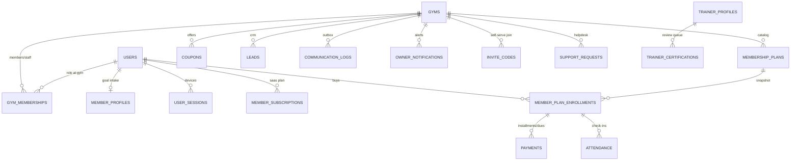

# FitForge — Database Overview

There is **no database code in this repository** (frontend-only). This document reconstructs the
backend schema from two sources:

1. The frontend models in `lib/models/*.dart` (fields the frontend actually reads/writes).
2. The repo-root handoff documents (`section2-handoff.md`, `BACKEND_REQUIREMENTS_DASHBOARD.md`).

Anything not derivable from these is marked **Not found in source code**.

## 1. Known entity families

### Users & auth

| Entity | Fields observed in frontend | Notes |
|---|---|---|
| `User` (platform account) | `id`, `email`, `firstName`, `lastName`, `fullName`/`name`, `avatarUrl`, `phone`, `isEmailVerified`, `isPhoneVerified`, `isSuperAdmin`, `createdAt`, `gymMemberships[]`, `memberProfile{}` | from `GET /users/me` |
| `UserSession` | `id`/`_id`, `userAgent`/`device`, `createdAt`, `lastUsedAt`/`updatedAt` | from `GET /auth/sessions` |
| Refresh/access tokens | — | rotation-invalidates refresh tokens (see `authentication.md`) |

### Member profile & subscriptions

| Entity | Fields observed | Notes |
|---|---|---|
| `MemberProfile` (goal intake) | `dateOfBirth`, `sex` (MALE/FEMALE), `heightCm`, `weightKg`, `goal` (FAT_LOSS/MUSCLE_GAIN/STRENGTH/SPORT_SPECIFIC/GENERAL_FITNESS), `experienceLevel` (BEGINNER/INTERMEDIATE/ADVANCED), `dietaryPreference` (VEG/VEGAN/NON_VEG + EGGETARIAN/JAIN from edit screen), `budgetBand` (LOW/MEDIUM/HIGH), `equipmentAccess` (FULL_GYM/HOME_EQUIPMENT/NO_EQUIPMENT), `injuriesNotes`, `weeklyFocus`, `onboardingCompletedAt` | `GET/PATCH /members/me/profile` |
| `MemberSubscription` | `planCode`, `status` (ACTIVE/TRIALING/EXPIRED/NONE), `trialPhase` (FULL_ACCESS/LIMITED), `startDate`, `endDate`, `trialStartDate`, `trialEndDate` | `GET /subscriptions/me`; plans: `MEMBER_PREMIUM_AI` (trial) |
| `MemberEntitlements` | `tier` (FREE/TRIAL_FULL/TRIAL_LIMITED/PREMIUM), `features{aiPlans, trainerChat, nutritionAnalysis}` | `GET /subscriptions/me/entitlements` |

### Gyms

| Entity | Fields observed | Notes |
|---|---|---|
| `Gym` | `id`/`gymId`, `name`, `phone`, `email`, `addressLine`, `city`, `state`, `pincode`, `logoUrl`, `upiId`, `upiQrCodeUrl`, `facilities[]`, `workingHours[]` ({day, isClosed, opensAt, closesAt}), `photoUrls[]`, `mutedOwnerAlertTypes[]` | `GET/PATCH /gyms/:gymId`, `POST /gyms` (CreateGymDto: name, phone, email, addressLine, city, state, pincode, referralCode) |
| `GymMembership` (user↔gym link) | `gymId`, `gymName`, `role` (GYM_OWNER/GYM_MANAGER/FRONT_DESK/TRAINER/MEMBER), `membershipId`/`id`, `status` | nested in `GET /users/me → gymMemberships[]` |
| Gym SaaS subscription | `planCode` (GYM_PRO), `status` (TRIALING…), `trialEndsAt` | `GET /gyms/:gymId/subscription` |
| Join request | `id`→membershipId, `user{}`, `joinedAt` | `GET /gyms/:gymId/join-requests` |
| Invite code | `role`, `code`, `revokedAt`, `expiresAt`, `maxUses`, `usesCount`, `id` | `GET/POST /gyms/:gymId/invites` |
| Gym referral reward config | `rewardType` (FREE_DAYS/FLAT_DISCOUNT_COUPON), `rewardValue`, `isActive` | `GET/PUT /gyms/:gymId/referrals/config` |

### Members / staff

| Entity | Fields observed | Notes |
|---|---|---|
| `GymMember` | `membershipId`/`id`, `userId`, `firstName`, `lastName`, `email`, `phone`, `avatarUrl`, `role`, `status` (ACTIVE/EXPIRED/FROZEN/PENDING), `planName`, `startDate`, `endDate`, `assignedTrainerName/Id`, nested `user{}` | `GET /gyms/:gymId/members`; 360° view via `GET .../members/:membershipId` |
| Member record extras | `photoUrl`, `idProofType`, `idProofNumber`, `idProofUrl`, `emergencyContactName`, `emergencyContactPhone` (staff-editable), `staffNotes` (private) | `PATCH .../members/:id/profile`, `PATCH .../members/:id/notes` |
| Trainer config | `shiftSchedule`, `commissionPercent` | `PATCH .../members/:id/trainer-config` |
| Trainer profile | `bio`, `specializations[]`, `experienceYears`, `introVideoUrl`, `photoUrls[]`, `verificationStatus` (UNVERIFIED/PENDING/VERIFIED/REJECTED) | `GET/PATCH /trainers/me/profile` |
| Trainer certification | `id`, `title`, `issuer`, `fileUrl`, `verificationStatus`, `rejectionReason`, `uploadedAt` | `POST /trainers/me/certifications`, admin review queue |

### Membership plans & enrollments (Section 2 handoff)

- **`MembershipPlan`** (the menu item): `id`, `name`, `description`, `type` (DURATION/SESSION),
  `durationDays`, `sessionCount`, `priceInr`, `isActive` (soft-retire via DELETE).
- **`MemberPlanEnrollment`** (the order — one member's instance of a plan): `id`, `status`
  (ACTIVE/FROZEN/EXPIRED/CANCELLED), `userId`, `planId`/`plan{}`, `startDate`, `endDate`,
  `priceInr` (snapshotted at purchase), `sessionsTotal`/`sessionCount`, `sessionsRemaining`,
  `couponCode`, `previousEnrollmentId` (renewal lineage), `assignedTrainerId`/`assignedTrainer{}`,
  `dueAmountInr`/`dues` (live-computed).

### Payments

| Entity | Fields observed | Notes |
|---|---|---|
| `Payment` | `id`, `receiptNumber` (gym slug + zero-padded counter, e.g. `SMOKE-TEST-GYM-8RGT5-000042`), `enrollmentId`, `memberName`/`member{}`, `amountInr`, `method` (CASH/UPI_MANUAL/BANK_TRANSFER/CARD_OFFLINE/OTHER), `paidAt`, `voidedAt`, `notes`, `isVoided` | soft-void only, never hard-delete |
| Dues | computed live: `enrollment priceInr − Σ(recorded payments)` | `GET /gyms/:gymId/payments/dues` |

### Attendance

| Entity | Fields observed | Notes |
|---|---|---|
| `AttendanceRecord` | `id`, `userId`, `memberName`/`member{}`, `memberAvatarUrl`, `attendedOn`, `checkInMethod` (QR/MANUAL/CALENDAR) | one entry per member per day; re-scans idempotent |
| Absence alert | `userId`, `memberName`, `daysSinceLastVisit`/`daysSince`, `lastVisitedOn`/`lastVisit` | derived, not stored |

### Coupons

`id`, `code` (case-insensitive), `type`/`discountType` (PERCENT/FLAT), `value`/`discountValue`,
`validFrom`, `validUntil`, `usageLimit`, `usageCount`, `applicablePlanIds[]`, `isActive`
(soft-delete via DELETE). Redemption history per coupon.

### Leads (CRM)

`id`, `name`, `phone`, `email`, `source` (WALK_IN/PHONE/INSTAGRAM/WEBSITE), `stage`
(NEW/CONTACTED/INTERESTED/CONVERTED/LOST), `assigneeId`/`assignee{}`, `notes`,
`convertedUserId`, `createdAt`, `followUpAt`.

### Communications

`id`, `recipientUserId`/`recipient{}`, `recipientName`, `recipientPhone`, `channel`
(EMAIL/WHATSAPP/SMS/PUSH), `messageType`/`type` (EXPIRY_REMINDER/DUES_REMINDER/ABSENCE/
BIRTHDAY/RECEIPT/ANNOUNCEMENT), `subject`, `body`, `waLink`/`whatsappLink`, `sentAt`,
`markedSentAt`, `estimatedCostInr`, `isPending`.

### Owner notifications

`id`, `templateType`, `subject`, `body`, `readAt`, `createdAt`. Template types observed in
code: `OWNER_JOIN_REQUEST`, `OWNER_RENEWAL_DUE`, `OWNER_MEMBERSHIP_EXPIRED`,
`OWNER_COUPON_REDEEMED`, `OWNER_TRAINER_JOINED`, `OWNER_TRAINER_UPDATE`.

### Support requests

`id`, `category` (BILLING/TECHNICAL/ACCOUNT/OTHER), `subject`, `message`, `status`
(OPEN/IN_PROGRESS/RESOLVED), `resolutionNotes`, `createdAt`.

## 2. Relationships

## 3. Not built yet (per BACKEND_REQUIREMENTS_DASHBOARD.md)

The member-side daily-tracking domain (daily logs, water/step logging, tasks, meal logs,
weight/measurement logs, user rewards/redemptions, leaderboard cache) **does not exist yet** —
the corresponding screens are mock. The document specifies the required schema (DAILY_LOGS,
WEIGHT_LOGS, BODY_MEASUREMENTS, DAILY_TASKS, USER_TASKS, MEAL_LOGS, USER_REWARDS, REDEMPTIONS)
as a backend requirement, not as existing tables.

## 4. Cron jobs (per section2-handoff.md)

- Expiry reminders at 7/3/1 days out (communications hub).
- Dues reminders (forced WhatsApp channel).
- Absence/win-back reminders.

## 5. Caveat

Exact table names, column types, and constraints: **Not found in source code** (no backend
code in this repo). Use the live Swagger spec at `https://fitos-backend-55g6.onrender.com/docs`
for authoritative schema details.